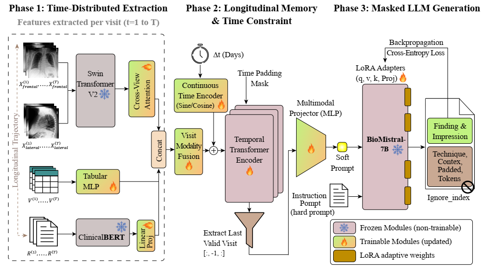

# Beyond Single Visits: Learning Longitudinal Patient Trajectories for Radiology Report Generation

> **The clinical reality:** Radiologists never read an X-ray in a vacuum. They look at the patient's history, previous scans, and current vitals to understand how a disease is evolving. **Why should our AI models be any different?**

Welcome to the official PyTorch implementation of our temporally-aware multimodal framework. While most Medical Vision-Language Models (VLMs) treat patient visits as isolated, cross-sectional snapshots, our architecture embraces the longitudinal nature of real-world healthcare. By tracking patient disease trajectories over time, this framework bridges the critical gap between static AI models and dynamic clinical workflows.

  
   
  <em>Figure 1: Our end-to-end architecture fusing sequential chest X-rays, clinical text priors, and vital signs into a continuous temporal memory before projecting to a Large Language Model (BioMistral).</em>

---

## 🌟 The Core Philosophy & Key Innovations

We built this framework to answer a fundamental question: *How can an AI accurately generate a medical report if it doesn't remember the patient's last visit?* 

To solve this, we introduced several architectural breakthroughs:

* ⏱️ **Continuous Longitudinal Memory:** Patient visits are highly irregular (one visit today, the next in 3 months). Instead of standard sequential models, we utilize a **Trigonometric Time-Gap Encoder** alongside a Temporal Transformer. This allows the model to deeply understand non-uniform time gaps between visits.
* 🧠 **Smart Vision Extraction (Attention Pooling):** Standard global average pooling loses critical spatial details. We replaced it with a learnable **Attention Pooling** mechanism on top of Swin Transformers, forcing the model to intelligently focus on pathological regions (e.g., small opacities or effusions).
* 🗜️ **Pathway Compression via Soft Prompts:** Feeding a patient's entire medical history directly into an LLM would explode the context window and cause VRAM overflow. Our **Multimodal Projector** gracefully compresses the holistic patient state into dense "Soft Prompts," seamlessly injecting years of medical history into **BioMistral-7B** without textual bloat.
* 🔬 **Holistic Patient State:** We don't just look at images. The model dynamically fuses Chest X-Rays, structured vital signs, and prior clinical text (Chief Complaints, Previous Diagnoses) into a single, unified representation space.
